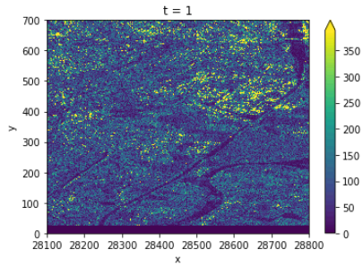
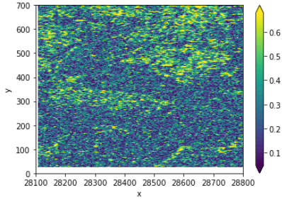

# Preprocess Sentinel 1 SLC Data on Terrascope

This is the outcome of an internship. The goal was to investigate a possible on-the-fly coherence calculation and integrate it into openEO. We found that a complete on-the-fly calculation is not feasible and thus switched plans to preprocess the Terrascope S1 SLC archive up to certain level such that coherence and terrain-correction are the only steps left (see also the [SAR2Cube project](https://github.com/SARScripts/preprocess) by EURAC). 

### Overview
* `/aoi` An aoi is needed to decide which area we're dealing with in terms of setting reference scenes and processing
* `/img` Images for `LOGS.md`
* `/SNAP-workflows` 
* `/terrascope` Various operations directly on Terrascope, like working with the `Catalogue` etc., also SNAP `gpt` doesn't *just work*, so Docker containers are used later on.
* `/preprocessing` Make a `geojson` of some reference scenes that all other scenes will be coregistered to. See readme.
* `/spark_processing` Orchestrate the processing on the cluster using spark and Docker. 
* `/relative_frames_examples` Some examples on what is contained in the Terrascope archive. Just to illustrate why and aoi is used
* various python notebooks: Used for figuring stuff out, not important code-wise
* `LOG.md` A rolling log of my work, documenting problems, errors, solutions and general information on coherence calculation

### Getting this to work

1. consult `/preprocessing` readme for more info on getting started there. Two things are needed: a `reference_bursts.geojson` with the reference scenes and a `processing.geojson` with all bursts that shall be processed.
2. consult `/spark_processing` readme and run `sh spark_processing/run-cluster.sh`. 

### Calculating Coherence

* The coregistered products actually don't need their reference imagery anymore, so all `<i/q>_<VV/VH>_mst_<date>.img` or the likes can be deleted
* coherence can then be calculated as shown in `coherence.ipynb`:
  * load `i` and `q` bands of two dates
  * in this case, S1A scenes were used to ensure that pixels were overlapping. Usually, this would require a process involving geographic location related to the `.img` files
  * following SAR2Cube: calculate complex coherence, aggregate over spatial window, calculate intensity
* terrain-correction is still missing

So here is the outcome, a coherence calculated over images that were coregistered to a *common* reference and not to each other:
**Intensity** | **Coherence**
:--:|:--:
 | 