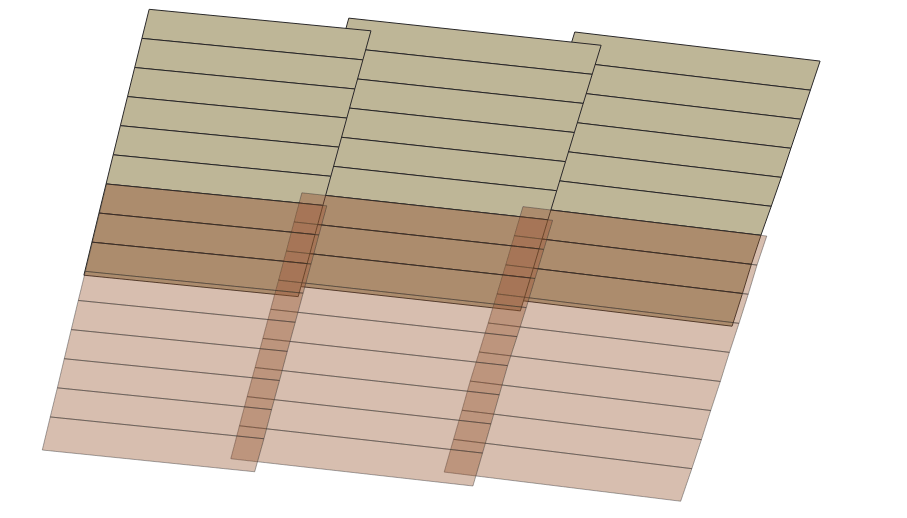

# Options to Calculate a S1 Coherence on the VITO backend

* SLC data is on terrascope, could be reached via VM
* there is no CARD4L ARD standard yet, couldn't find a draft document
* [ISCE3 framework](https://github.com/isce-framework/isce3/) seems to be interesting but doesn't support S1 yet: "ISCE3 developments is driven by NISAR and therefore the software does not formally support Sentinel-1 yet. As we will add Sentinel-1 support to isce3 we can build other algorithms within isce3." [ISCE2](https://github.com/isce-framework/isce2) might.

## TODO
- [] try out OTB &  DiapOTB
- [] try pyroSAR
- [] try preprocessing, SAR2Cube

## Coherence

"Therefore, the phase noise changes from pixel to pixel due to the different impact of the random noise superposed on the random amplitudes of the pixels. Pixels with weak returns will show more dispersed interferometric phases; strong and stable scatterers will yield more reliable phases. In addition, there are important changes between the two acquisitions: temporal, due to the change in the off-nadir angle, and due to random noise. We now define the measure of this change γ, the coherence of the two SAR images (also called the complex correlation)." Ferretti, 2007.


with  being the coherence estimation, `*` being the complex conjugate.

A coherence correction is also discussed. Not sure which implementations consider this, it seems terrain dependent.

## Data at Terrascope

* [https://docs.terrascope.be/#/DataProducts/Sentinel-1/ProductsOverview](https://docs.terrascope.be/#/DataProducts/Sentinel-1/ProductsOverview)
* How is the data organized?
* How are sub-swaths and bursts handled?

## Needed Processing Steps

This should be a list of the needed processing steps from SLC level to a finished coherence product. Decisions can be made later as to what extent it might be useful to preprocess some of these steps. My guess would be that only doing _all_ steps on the fly will result in a flexible coherence workflow. This list might also be helpful to distinguish between steps that can be done using some library and steps that might need to be implemented.

### ASF Tutorial on Interferogram

found [here](https://asf.alaska.edu/how-to/data-recipes/create-an-interferogram-using-esas-sentinel-1-toolbox/). Byproduct is the coherence. Need to check if the coherence is influenced by all other processing steps and which of them are really needed.

Multiple sub-swaths are used by doing coregistration - deburst for each swath, then merging and doing remaining steps.

* Coregistration of the images into a stack
  * one reference and 1-n secondaries
  * select sub-swath (with TOPSAR-Split)
  * Apply orbit state vectors
  * Back-geocoding with DEM
  * extra output needed if ESD (Enhanced Spectral Diversity) is needed
* Coherence estimation (and interferogram formation in the tutorial)
  * flat-earth-phase removal
* TOPS-Deburst
  * to join bursts together
* Topographic phase removal
* Multi-looking 

### ESA, Skywatch Tutorial

"Sentinel-1 Toolbox TOPS Interferometry Tutorial", Braun & Veci. Basically the same as ASF tutorial.

* Coregistration
  * done in single steps
  * TOPS-Split: select needed bursts
  * Apply orbit info: S1 POD service
  * Back geocoding: Actual coregistration, DEM
  * ESD option (if more than one burst, additional corrections applied)
* Coherence estimation has a window size (10x3) by default
* TOPS-Deburst
* subsets: can only be chosen now, seems like whole bursts need to be processed for interferogram/coherence?

### VITO SNAP Workflow

* Read
* Apply Orbit File
* TOPSAR-Split of all three subswaths
* Back-Geocoding for all swaths
* ESD
* Coherence: no flat earth phase removal, 10x3
* TOPS-Deburst
* TOPSAR Merge (Swaths or diff. scenes)
* Terrain Correction (to 20x20m pixels)
* Write

### General Steps

1. Preprocessing
2. Coherence Estimation
3. Geocoding

### H. Zebker

* "Note that there is no technical case to be made for analyzing data on a regular grid rather than range-Doppler coordinates"
* the order of some processing steps can be altered 
* moving terrain correction and geocoding upstream before the interferogram formation
* mostly useful when all-to-all interferograms are needed (N*(N-1)) / 2 (not consecutive) -> what should the process allow? Use cases needed
* needs to be applied to all data beforehand
* if data would be hosted that way, InSAR would of course be faster
* could speed up OTF processing if all-to-all coherence is neede for some reason, but this might be only the case when interferograms are calculated, and then it could also be part of the interferogram processing which is of no issue here

## Implementation Options

### Orfeo Toolbox & diapOTB

Orfeo Operations include
* SARCoRegistration
* SARDeburst
* SARESD
* SARMultilook
-> **preprocessing steps are there**

DiapOTB
* seems to have applicable processing chains
* SARInterferogram **outputs an interferogram *and* the coherence**

### pyroSAR - SNAP

* could be used to do all processing in SNAP (therefore this **looks like the "safe" option**)
* seems that if the tasks are done 1 by 1 separately, the speed might be adequate or acceptable
* [readthedocs](https://pyrosar.readthedocs.io/en/latest/index.html)
* "SNAP’s Python API snappy is not used due to installation limitations and processing performance."
* see Truckenbrodt et al.: "Towards sentinel-1 SAR analysis-ready data: A best practices assessment on preparing backscatter data for the cube"

### SAR2Cube

* could the preprocessing steps be done on the fly?
* if yes, that + the existing coherence & geocoding workflow could also work
* tried the preprocess module, couldn't install jpy correctly (although without errors), "no module named jpyutil"

**Questions for SAR2Cube**
* Were there specific reasons for which steps were preprocessed and which weren't?
* What is missing for on-demand preprocessing?
* Were any bottlenecks identified?
* Which scenes were coregistered? Neighbouring scenes or all to one?

**Questions for the timeseries example process**
* Why an additional multilooking after the coherence? Calculating coherence already contains a window
* `rename_labels(dim = "bands")` is executed after `reduce_dimension("bands")`. This is logically flawed, there might be a `add_dimension()` missing?
* In the timeseries usecase, `reduce_dimension(reducer = sqrt(Intensity))` is calculated after the coherence process, why is that done? (coherence would be a value [0..1])

**Open Questions**
* Talk from DESCARTES Labs: some kind of "static terrain correction", how would that work?
* Fast burst access might be bottleneck
* Is ASF Vortex open-source?
* Coherence Formula explanation

## install OTB

Problems with python bindings, magic thing that worked: `sudo ln -s /usr/lib/x86_64-linux-gnu/libpython3.8.so /usr/lib libpython3.5m.so.rh-python35-1.0` from [here](https://gis.stackexchange.com/questions/220427/importing-otbapplication-in-python). + doing `source ./OTB-7.4.0-Linux64/otbenv.profile` once in a while

[S1 burst/swath tool](https://github.com/pbrotoisworo/s1-tops-split-analyzer)

[orfeo cookbook](https://www.orfeo-toolbox.org/CookBook/Applications.html)

[diapotb docs](https://gitlab.orfeo-toolbox.org/remote_modules/diapotb/-/wikis/Applications/app_SARDEMProjection)

[snap snapyy doc](https://senbox.atlassian.net/wiki/spaces/SNAP/pages/50855941/Configure+Python+to+use+the+SNAP-Python+snappy+interface)

[sar2cube](https://sar2cube.netlify.app/)

```batch
cmake -D CMAKE_INSTALL_PREFIX=~/OTB/install ../otb/SuperBuild
cmake -DOTB_USE_QT=OFF
cmake -DOTB_USE_QT=OFF ../otb/SuperBuild
make
sudo apt install swig
make
```

* trying SARCoRegistration
* claims products do not inhibit the same physical space
* tried out in SNAP, coherence of 2 bursts in IW2, works good, product is a bit coarse but probably as expected..

## try pyroSAR

* "SNAP’s Python API snappy is not used due to installation limitations and processing performance."
* can run coherence process by first building a graph, then executing it. format "GeoTIFF". ESD not working, around 6 minutes with apply-orbit-file taking up about 18GB of RAM
* in SNAP for comparison: S1 TOPS coreg instead of Back-geocoding?
* SNAP needs 3 mins for same workflow..?
* produces close to same results when coherence window is given
* actually faster without groups, this might change for longer, more complex workflows..
* Can I automate IW and burst selection with this github repo? Add a merge step...
* ESD only needed with more than one burst
* maybe: create db with S1 scenes, filter db for matching input (what is returned by `load_collection`?), ...

Script: input SLC scene and shapefile, automatic swath and burst selection.
Run time for 3 bursts over 2 swaths:
* python: ~25min, ungrouped
* SNAP: 21min
* python: 9min, grouped

apply-orbit-file (applied on the whole file, topsar-split afterwards) and back-geocoding seem to take up the most time.
**Bottlenecks are: apply-orbit-file on whole scene, all other processes on whole bursts instead of only AOI**

* SAR2CUBE does topsar-split first, apply-orbit-file afterwards -> improves memory demand and processing time, results look exactly the same. while less memory is good, processing time win is capped by the fact that it needs to be run for each subswath then, so only makes things faster to a certain degree, especially if a couple bursts of one swath are used
* ESD? dual-pol?
* ESD needed fir interferometry, should be considered for coherence as well

## Trying to Execute diapTOB chains via python

* Not sure if diapOTB installed correctly or why it even exists since it has all(?) the same processes that are in OTB already. 
* the gitlab directory contains processing chains (see wiki) in `python_src` that can be executed together with the right config `.json` file in `./share/ex_config/`
* * ESD fails with error: `TilesAnalysisImageFilter(0x55bbf55d1bb0): Provided MaxShifts are not consistents. Check the input grid`
* try with `ESD_iter = 0`: works. was `2` originally. 
* the `coRegistration_S1IW.py` chain produces (when ESD is left out) coregistered, deramped tifs for ref and secondary.
* chain `diapOTB_S1IW.py` gives back orthorectified interferogram and (not orthorectified) coherence image
* coherence image (in `/filt`) can be georeferenced with the same command as its done for the interferogram at the bottom of the chain script
* afterwards I use `gdalwarp` to reference again since this automatic referencing is a mess.
* next: **compare SNAP and OTB coherence calculations**: measure time with `time python..`, do it on same area:
  * IW2, bursts 3-5 chosen, thats burst 2-4 in OTB counting
  * `pyro11.py` pyroSAR, with grouped workflow and apply-orbit-file only on the bursts, 10x3: real 5m21.896s
  * `diapOTB_S1IW.py` OTB processing chain, no ESD (it fails), 8x2, additionally produces interferogram: real 5m1.582s
  * results do not look the same, OTB result much more coherent but seems less quality, there is a striping effect, fields are often completely coherent (weird). Also has finer ground res (due to parameter `Spacingxy`)
  * trying to mess a bit with parameters: `SARCorrelationGridFilter(0x55e64e283600): GridSteps range mot a multiple of MLRan`
  * this warning pops up in the logging file, not sure if its important towards the whole coh thing: `func_utils.py :: INFO :: 2021-11-15 15:59:35 (WARNING): Encoding of file (/home/petra/Praktikum_VITO/S1A_IW_SLC__1SDV_20211014T165252_20211014T165319_040118_04C01F_7558.SAFE/measurement/s1a-iw2-slc-vv-20211014t165253-20211014t165318-040118-04c01f-005.tiff) is complex but will be read as a VectorImage of scalar type, with twice the number of bands.`
  * coherence improves when I change `"Filtered_Interferogram_mlran" : 10, "Filtered_Interferogram_mlazi" : 3` to 10x3, but is still faulty.
  * no other possibilities found to influence this process, so asked OTB forum.

## Digging into the RAM settings
Bare in mind that these processes are done only on 3 bursts of the same subswath..

* **OTB** RAm settings can be made in config file of the process in question, executed previously with 2560 MB (~2.5GB), not set: `"optram" : 4096`, observed: max 3.3GB used by `python` process, time: 5min4s (which is a bit faster, because in comparison to the first measurements there is an additional georeferencing taking place)
* Important to keep in mind is that the process produces interferograms we don't want
* **SNAP** RAM settings are in `<user>/<install-dir, e.g. esa-snap>/bin/gpt.vmoptions` ([forum thread on more info](https://forum.step.esa.int/t/gpt-and-snap-performance-parameters-exhaustive-manual-needed/8797)), previously `-Xmx16G`, now set to `-Xmx4G`, process takes 5m35s, not much longer than before, with the most time spent on Back-Geocoding (coregistration)

As a intermediate result: OTB is a bit faster, but produces unusable output.. If these errors can be fixed it should be the main option, if not, SNAP is a solid backup.

**important: As to now, SNAP reads .zip and OTB read .tifs in .SAFE folders** 

## Working on TerraScope VM

* Data lies as .zip on TerraScope (`/data/MTDA/CGS_S1/IW/DV/...`), SNAP 8.0 is installed.
* use `terracatalogueclient` to query for products
* install `s1-tops-split-analyzer` from github repo clone using `pip install --user .`
* trying to install pyroSAR via `pip install --user pyroSAR`, but `pg_config` can't be found - need to add to path like `export PATH=/usr/include/:$PATH`

full error message
```
    Error: pg_config executable not found.
    
    pg_config is required to build psycopg2 from source.  Please add the directory
    containing pg_config to the $PATH or specify the full executable path with the
    option:
    
        python setup.py build_ext --pg-config /path/to/pg_config build ...
    
    or with the pg_config option in 'setup.cfg'.
    
    If you prefer to avoid building psycopg2 from source, please install the PyPI
    'psycopg2-binary' package instead.
```

* logged to terrascope forum... received reply:
* had to install: `sudo yum install -y postgresql-devel`
* the I could install `pip install --user psycopg2` and `pip install --user pyroSAR`

**OSV error**

* upon running, SNAP error: `qc.sentinel1.eo.esa.int: Name or service not known`, checked in SNAP GUI, same error. Forum suggested updating, which was done before, then Apply-Orbit-File worked in GUI

[Thread](https://forum.step.esa.int/t/orbit-file-timeout-march-2021/28621/159) for problem with the orbit files:

* My problem:`qc.sentinel1.eo.esa.int: Name or service not known`
* **updating SNAP**: done in GUI, checked command line aswell via `snap --nosplash --nogui --modules --list`, resulted and version of `org.esa.s1tb.s1tbs.kit` is `8.0.5`
* try downloads manually via pyroSAR in same script, seems they are put in the correct folders by pyroSAR.. SNAP might not find them, like so:

```
from pyroSAR.S1 import OSV

osvdir = r’\OrbitFiles\S1’

with OSV(osvdir) as osv:
files = osv.catch(sensor=‘S1B’, osvtype=‘POE’,
start=‘20170101T000000’, stop=‘20210501T000000’) #define dates here
osv.retrieve(files)
```

* error in this thread seems mostly to be that no orbit files are found
* "Another reason snap might not download the orbit file is that you are working behind a proxy, so you need to setup the proxy by going in snap>bin>gpt.vmoptions and setting the following"
* file found at `./usr/local/snap/bin/gpt`.. proxy links unclear, clarify next week. `echo $http_proxy` is empty so no proxy is configured on system level, but it might be by the VM?

* apply-orbit-file works when OSV files are downloaded separately, see `get_orbit_files.py`!

**jblas error**
* workflow.xml not accepted by GraphBuilder, some Problem with "Coherence" node: `Error: [NodeId: Coherence] org.jblas.NativeBlas.dgemm(...` (brackets and Cs)
* forum suggests downgrade to SNAP7 or installing libfortran5
* problem (coherence) persists when going through the process manually

* with resolved OSV error, process continues to `Back-Geocoding`, but fails with `RuntimeError: Executing processing graph org.jblas.NativeBlas.dgemm(CCIIID[DII[DIID[DII)V`, similar to the error with the Coherence process in SNAP GUI
* [forum thread](https://forum.step.esa.int/t/error-in-sar-image-corregistration-error-nodeld-createstack-org-jblas-nativeblas-dgemm-cciiid-dii-diid-dii-v/12023?page=2) suggests a problem with `libgfortran3` package, but installing all available libgfortran* (3 not available) packages, nothing changes
* terrascope forum...
* get libgfortran some place else ([thread](https://forum.step.esa.int/t/error-in-applying-ers-orbit-informations/23195/13)) and copy into `/usr/lib`, which didn't get things to work.. also it seems that `libgfortran.so.3` was present in `/usr/lib/lib64` and `/usr/lib64` the whole time..
* trying to run VITO Coherence process graph in VM SNAP with source products selected gives `org.esa.snap.core.gpf.graph.GraphException`
* try https://src.fedoraproject.org/rpms/jblas
* tried, gives dependency errors and I can't seem to find the packages it needs.. e.g. java-headless seems to be installed with java, and there is no rpmlib
* update by jeroen: try to replace jblas
* jblas found in `/usr/local/snap/s1tbx/modules/ext/` both in `org.jlinda.jlinda-core` and `org.jlinda.jlinda-nest`.
* saving the existing `jblas.jar` to public dir, append `_nest` and `_core`..
* nothing changes, same error, so did the same in `home/jonathanbahlmann/.snap...` (find with `sudo find / -name "*jblas*"`)
* `sudo cp -rf /home/jonathanbahlmann/Downloads/jblas-1.2.5.jar /home/jonathanbahlmann/.snap/system/modules/ext/org.jlinda.jlinda-nest/org-jblas/jblas.jar`
* 

## find out how much time can be saved by preprocessing in a SNAP workflow

* apply orbit file takes 100 seconds with all RAM
* but I can't read the BEAM-DIMAP `.dim` into the following workflow.. They can only be added to SNAP, but seems pyroSAR issue
* but it works with just gpt (executed from `/home/esa_snap/bin`): `./gpt /home/petra/Praktikum_VITO/pyroSAR/pyro11_apply_orbit_workflow.xml`, but no grouping of course, so takes considerable time (~19.41min) vs 22.31min without pre-applied orbit files.
* using gpt on VM (executing `usr/local/snap/bin/gpt ./SNAP_workflow.xml` instead of giving path to xml in gpt directory) seems to fail with about the same problem with OSV files as above, even though files are present. This doesn't matter much as gpt is much slower anyway

## investigating errors in diapOTB processing chain

imported are python classes with their functions that organize and bundle functions from diapOTB. diapOTB functions are used throughout the chain, even though the second level apps seem to be available in base OTB as well (SAR* prefix).

* What calculation steps are done in what order?
  1. imports:
    ```
    from processings import Pre_Processing
    from processings import Ground
    from processings import DInSar
    from processings import Post_Processing     
    ```
  2. parameters from dictionairies
  3. find EOF files
  4. Metadata handling, correction
  5. Preprocessing Chain
     1. extractToMultilook (ref, then sec)
        1. **multilook**: creates the multi-look image of a SLC product.
        2. **deramp**: deramping or reramping of S1 Iw burst.
        3. **burstExtraction**: consist in extracting a single burst, by selecting only lines and samples of the wanted burst.
        4. **doppler0**: estimates the value of Doppler 0 for a SAR image. The algorithm is based on the CDE method described into [Estimating the Doppler centroid of SAR data].
  6. Ground Chain
     1. demProjectionAndCartesianEstimation (ref, then sec)
        1. for ref: **cartesianMeanEstimation**: estimates a simulated cartesian mean image thanks to a DEM file.
        2. for sec: **demProjection**: puts a DEM file into SAR geometry and estimates two additional coordinates. In all for each point of the DEM input four components are calculated : C (colunm into SAR image), L (line into SAR image), Z and Y.
  7. DInSAR Chain
     1. gridToInterferogram (ref, sec as input)
        1. **fineGridDeformation**: executes the geo_grid step with three internal applications : 
           1. **SARCorrelationGrid**: computes correlation shifts between two images : shift in range and shift in azimut.
           2. ,**SARDEMGrid**: creates a deformation grid related to the DEM with projections into Master and Slave SAR geometries. The output grid is a VectorImage composed of three values : shift in range, shift in azimut and a number of DEM points for contribution
           3. and **SARCorrectionGrid**: creates a deformation grid by correcting the DEM grid with correlation grid. The output grid is a VectorImage composed of two values : shift in range and shift in azimut
          
            The aim is to obtain a fine deformation grid between master and slave SAR images.
        1. **coRegistration**: does the coregistration between two SAR images thanks to a deformation grid.
        2. **deramp**: does the deramping or reramping of S1 Iw burst.
        3. **interferogram**: builds the interferogram between two SAR images.
        4. esd
        5. esd loop (not used in current runs cause it didn't work)
        6. **concatenate** (interferograms): seems like it uses concatenate bursts again
        7. return lists, as above as well
  8. Postprocessing Chain
     1. filtering (ref, sec as input)
        1. **phaseFiltering** -> this produces the coherence!: does the filtering for an input interferogram to to obtain a denoising phase.
        2. **addBandInterferogram**: Replace an amplitude for input interferogram and merge it to rebuild three bands (amp, pha and coh)
     2. **orthorectification** (interferogram, func from otb): trivial

* trying to compare maybe coregistered products?
  * OTB processed bursts 2-4 of IW2, pyroSAR 3-5 of IW2
  * compare burst otb.3 to pyrosar.4 (middle)
  * note on how I did this: loading into SNAP, zooming on upper right hand corner. SNAP products have bands i, q, and Intensity, diapOTB products have one unidentified band. I take the diapOTB images² to try an Intensity and it seems to work.

Comparison between images by how I believe to interpret the unmarked bands: Rows are Reference, Secondary, Columns are diapOTB, SNAP.

diapOTB                                           | SNAP
:------------------------------------------------:|:-------------------------------------:
  |  
  |  


Comparison gifs between diapOTB and SNAP coregistered Intensity images. The larger footprint with distortions on the right is SNAP imagery, the other is OTB

**Reference Comparison:** | **Secondary Comparison:**
:--:|:--:
 | 

**Result**: The coregistered images contain visible differences between softwares, but they all seem to be correctly coregistered images (internally). Doesn't look like this is the reason for coherence errors.

* then interferogram is build, but the function creating the interferogram is phaseFiltering. So having a look at `/app/otbSARPhaseFiltering.cxx`
* from `Post_Processing.py`, phaseFiltering is run with `withComplex="false"`, and it seems the original complex image is not given.. maybe I could try to add that?
* added the `incomplex` parameter to `Post_Processing.py`, getting `TypeError: phaseFiltering() got an unexpected keyword argument 'incomplex'`
* so function obviously doesn't come directly from `otbSARPhaseFiltering.cxx`, search with `grep -r "inForFiltering"`, get `/python_src/utils/DiapOTB_applications.py`, where it says:
* ```python
  This application performs a filtering for phase and coherency bands. 
  Two kinds of inputs are possible (according to the sensor and mode) : 
  _ complex conjugate image for S1 SM and Cosmo
  _ interferogram ML 11 fir S1 IW`
  ```
* ```python
  :param withComplex: A boolean to indicate selected input.     
  :param inForFiltering: Input for filtering (complex conjugate image or inteferogram).
  ```
* ```python
  appPhaFiltering = otb.Registry.CreateApplication("SARPhaseFiltering")
    if fUtils.str2bool(withComplex) :
      appPhaFiltering.SetParameterString("incomplex", inForFiltering)
    else :
      appPhaFiltering.SetParameterString("ininterf", inForFiltering)
  ```
* so `withComplex` decides whether the operation is done on a conjugated complex or an interferogram, then calls otbApplication
* maybe find the conjugated complex image and throw it in, see what happens? (the example value for an incomplex is a sentinel swath .tiff)
* coherence calculation must be done in some part of the imports.. (`.h files`)
* interesting lines in `otbSARTilesPhaseFilteringFunctor.h`:
  ```C
  for (unsigned int k = 0; k < m_SizeTiles*m_SizeTiles; k++)
	 {
	   norm = sqrt(FFTInvOut[k][0] * FFTInvOut[k][0] + 
		       FFTInvOut[k][1] * FFTInvOut[k][1]);

	   // Euclidian division
	   unsigned int i1 = k/m_SizeTiles; // quotient
	   unsigned int i2 = k - i1*m_SizeTiles; // remainder

	   if (norm != 0)
	     {
	       //TilesResult[k].real( (FFTInvOut[k][0]*wf[i1][i2])/norm );  
	       //TilesResult[k].imag( (FFTInvOut[k][1]*wf[i1][i2])/norm );
	       TilesResult[k].real( (FFTInvOut[k][0]*wf[i1][i2]) );  
	       TilesResult[k].imag( (FFTInvOut[k][1]*wf[i1][i2]) );
	     }
  ```
* .. and others, seems to be the file in which coherence is computed
* ```C
    while (!InIt.IsAtEnd())
     {
       real = InIt.Get().real();
       imag = InIt.Get().imag();
       norm = sqrt(real*real + imag*imag);
  ```
* moving on from here: trying to understand what's going on in this C file, where and how coherence is computed and if it is done correctly (maybe cross check with SNAPs Java implementation?), could ask in forum or in institute
* also thought: might be good to compare interferograms, but SNAP has this done through snaphu (external installation)..
* another area (city) could also tell us more about the coherence error thats happening

* **SNAP coherence**: [code](https://github.com/senbox-org/s1tbx/blob/a1ba1205829debdd056cf96920ce4f320fff1778/s1tbx-op-insar/src/main/java/org/esa/s1tbx/insar/gpf/CoherenceOp.java): there are wo functions, `calculateCoherence` 8only considers real parts) and `coherence`, of which the latter seems more realistic, but I can't make out everything thats happening..
  ```java
            for (k = 0; k < winL; k++) {
                for (l = minL; l < maxL; l++) {
                    //sum.addi(input.get(k, l));
                    //power.addi(norms.get(k, l));
                    int inI = 2 * input.index(k, l);
                    sum.set(sum.real() + input.data[inI], sum.imag() + input.data[inI + 1]);
                    power.set(power.real() + norms.data[inI], power.imag() + norms.data[inI + 1]);
                }
  ```
* checking with **SAR2Cube ODC driver implementation**:
  ```python
    VV_q_coh = (src.loc[dict(variable='i_VV',time=pair[0])]*src.loc[dict(variable='i_VV',time=pair[1])]+src.loc[dict(variable='q_VV',time=pair[0])]*src.loc[dict(variable='q_VV',time=pair[1])]) / np.sqrt((src.loc[dict(variable='i_VV',time=pair[0])]**2+src.loc[dict(variable='q_VV',time=pair[0])]**2)*(src.loc[dict(variable='i_VV',time=pair[1])]**2+src.loc[dict(variable='q_VV',time=pair[1])]**2))
    VV_i_coh = (src.loc[dict(variable='i_VV',time=pair[1])]*src.loc[dict(variable='q_VV',time=pair[0])]-src.loc[dict(variable='i_VV',time=pair[0])]*src.loc[dict(variable='q_VV',time=pair[1])]) / np.sqrt((src.loc[dict(variable='i_VV',time=pair[0])]**2+src.loc[dict(variable='q_VV',time=pair[0])]**2)*(src.loc[dict(variable='i_VV',time=pair[1])]**2+src.loc[dict(variable='q_VV',time=pair[1])]**2))
  ```
  so basically
  ```
    (i_VV[0] * i_VV[1] + q_VV[0] * q_VV[1]) / sqrt((i_VV[0]^2 + q_VV[0]^2) * (i_VV[1]^2 + q_VV[1]^2))
  ```
                   
* trying more urban area -> frankfurt. but needs DEM that I don't have yet. SNAP fails with `RESORB files are no longer available from https://scihub.copernicus.eu/gnss/odata/v1/`...
* coherence in OTB goes from -.07 to 1.07.. should be [0..1], there must be something wrong.

## Moving on: preprocess with SNAP, calculate coherence on the fly

* OTB won't deliver a correct coherence anytime soon, doesn't have an apply-orbit-file operation
* SNAP workflow takes it's time, too long for otf.
* therefore: preprocess in SNAP, hold data, do coherence and maybe post-processing on the fly
  1. pre-processing worklfow: what should be done?
     1. apply-orbit-file
     2. split?
     3. back-geocoding
     4. deburst
  2. coherence process itself (SAR2Cube?)
  3. post-processing: terrain correction

* set RAM to 4GB (file `pconvert.vmoptions` for processing in SNAP)
* apply-orbit-file: 120-150sec, using SWAP
* split: IW1, VV and VH, 13 sec write time
* back-geodoing: 150sec
* coherence: 71sec, deburst: 10sec, terrain-correction: 66sec
* deburst: 68sec, coherence: 66sec, terrain-correction: 63sec
* coherence doesn't work (doesn't respond) after terrain-correction
* so we can do deburst beforehand, how about merge? process IW2..
* merge 26sec
* coh_merge and merge_coh come out the same -> only terrain correction needs to be done later
* next: check up on SAR2Cube
* how should the scenes be coregistered? 
* SNAP coregistering 3 images leaves the last pair blank, so I guess only 2 possible, products then contain both images.
* SNAP can save intermediate products as GTIFFs and then continue working with them (that doesn't seem possible with OTB tifs), so bands i, q could be used to extract coregistered data..?
* TODO: try to extract bands from tif into single tifs to calculate coherence on them

## coherence investigation

[What is the difference between coherence and coherency?](https://www.fieldtriptoolbox.org/faq/what_is_the_difference_between_coherence_and_coherency/)

“Coherency” is the normalized cross-spectrum at a specific frequency, i.e. for two signals A and B it is defined as Cab/sqrt(Pa _ Pb) or equivalent Cab/sqrt(Caa _ Cbb). Coherency is a complex-valued number with a magnitude (or “modulus”) smaller than or equal to 1 and an angle corresponding to the phase lag between the signals.

The modulus of the coherency is known as the “coherence”. The coherence is a real-valued number between 0 and 1. Note that it is also not uncommon in scientific publications to report the magnitude-squared coherence.

[Wikipedia "" says](https://en.wikipedia.org/wiki/Coherence_(signal_processing))

The coherence (sometimes called magnitude-squared coherence) between two signals x(t) and y(t) is a real-valued function.

[formula]

where Gxy(f) is the Cross-spectral density between x and y, and Gxx(f) and Gyy(f) the autospectral density of x and y respectively. The magnitude of the spectral density is denoted as |G|. Given the restrictions noted above (ergodicity, linearity) the **coherence function estimates the extent to which y(t) may be predicted from x(t)** by an optimum linear least squares function. 

In SNAP there is a build-in help for functions that I need to read through, very interesting stuff

* the "Cross Correlation" op in coregistration (unsure if part of S1 TOPS coreg) uses coherence in "fine registration" step. it is maximized for optimal image alignment.
* "Back-Geocoding": In resampling the slave images into master frame, **deramp** and **demodulation** are performed first to the slave image, then the truncated-sinc interpolation is performed. Finally, the **reramp** and **remodulation** are applied to the interpolated slave image.
* "ESD" op. calculates offsets in range and azimuth for the whole image. has option to not write target products but write offset to file. *so maybe this offset could be applied to the grid in geocoding?*
* 
* also next: how does sar2cube create a stack of all scenes?

## docker

`docker run -it -P --name s1tbx_test1 -v /home/jonathanbahlmann/Public/docker:/VM_out -v /data/MTDA:/VM_in mundialis/esa-snap:s1tbx`
`docker start -i s1tbx_test1`
```
RUN apk add --update --no-cache python3 && ln -sf python3 /usr/bin/python
RUN python3 -m ensurepip
RUN pip3 install --no-cache --upgrade pip setuptools
```
`apk add git`

can run gpt via ./usr/local/snap/bin/gpt ./VM_out/SNAP_workflow.xml
but cant access input files due to symbolic link loops

copied example files to `VM_out` to skip this link issue, execute gpt:
```
WARNING: org.esa.s1tbx.sar.gpf.orbits.ApplyOrbitFileOp: Using Sentinel Precise /root/.snap/auxdata/Orbits/Sentinel-1/POEORB/S1B/2021/10/S1B_OPER_AUX_POEORB_OPOD_20211102T112525_V20211012T225942_20211014T005942.EOF.zip instead
INFO: org.esa.s1tbx.io.sentinel1.Sentinel1Level1Directory: Less than 8K RAM. Using FileCacheImageInputStream
INFO: org.esa.s1tbx.io.sentinel1.Sentinel1Level1Directory: Less than 8K RAM. Using FileCacheImageInputStream
INFO: org.esa.s1tbx.io.sentinel1.Sentinel1Level1Directory: Less than 8K RAM. Using FileCacheImageInputStream
INFO: org.esa.s1tbx.io.sentinel1.Sentinel1Level1Directory: Less than 8K RAM. Using FileCacheImageInputStream
INFO: org.esa.s1tbx.io.sentinel1.Sentinel1Level1Directory: Less than 8K RAM. Using FileCacheImageInputStream
INFO: org.esa.s1tbx.io.sentinel1.Sentinel1Level1Directory: Less than 8K RAM. Using FileCacheImageInputStream
WARNING: org.esa.s1tbx.sar.gpf.orbits.ApplyOrbitFileOp: RESORB files are no longer available from https://scihub.copernicus.eu/gnss/odata/v1/
OpenSearch: https://scihub.copernicus.eu/gnss/search?q=platformname:Sentinel-1 AND platformnumber:A AND producttype:AUX_POEORB AND beginposition:[2021-10-01T00:00:000Z TO 2021-10-31T24:00:000Z]
OpenSearch: 31 total results on 1 pages.
OpenSearch: https://scihub.copernicus.eu/gnss/search?q=platformname:Sentinel-1 AND platformnumber:A AND producttype:AUX_POEORB AND beginposition:[2021-10-01T00:00:000Z TO 2021-10-31T24:00:000Z]
WARNING: org.esa.s1tbx.sar.gpf.orbits.ApplyOrbitFileOp: Using Sentinel Precise /root/.snap/auxdata/Orbits/Sentinel-1/POEORB/S1A/2021/10/S1A_OPER_AUX_POEORB_OPOD_20211108T122749_V20211018T225942_20211020T005942.EOF.zip instead
#
# A fatal error has been detected by the Java Runtime Environment:
#
#  SIGSEGV (0xb) at pc=0x0000000000002076, pid=208, tid=0x00007f98e3eb3b38
#
# JRE version: OpenJDK Runtime Environment (8.0_232-b09) (build 1.8.0_232-b09)
# Java VM: OpenJDK 64-Bit Server VM (25.232-b09 mixed mode linux-amd64 compressed oops)
# Derivative: IcedTea 3.14.0
# Distribution: Custom build (Tue Mar  3 13:24:22 UTC 2020)
# Problematic frame:
# C  0x0000000000002076
#
# Core dump written. Default location: //core or core.208
#
# An error report file with more information is saved as:
# //hs_err_pid208.log
#
# If you would like to submit a bug report, please include
# instructions on how to reproduce the bug and visit:
#   https://icedtea.classpath.org/bugzilla
#
```

* seems to be a problem with jblas

* it seems that docker on linux can use as much ram as is available, so why the ram warnings?
* tring to run one single apply-orbit op, seems to work.
* testing different workflow in SNAP in docker, a workflow apply-orb-file takes very short, except a second read node is present, very weird behaviour, while the *same result* is calculated
* error above seems to occur as soon as geocoding is added to graph

* trying ubuntu container with full SNAP installation
* orbit file error (cant find valid file for 13.10.), copy existing files from VM
```
..10%....20%....30%....40%....50%....60%....70%....80%....90% done.
-- org.jblas INFO Deleting /tmp/jblas1073787788575822337/libquadmath-0.so
-- org.jblas INFO Deleting /tmp/jblas1073787788575822337/libgfortran-4.so
-- org.jblas INFO Deleting /tmp/jblas1073787788575822337/libjblas_arch_flavor.so
-- org.jblas INFO Deleting /tmp/jblas1073787788575822337/libjblas.so
-- org.jblas INFO Deleting /tmp/jblas1073787788575822337
```
* seems to work but slave image is empty (0)
* same result in snap gui
* investigating with stsa


This could be the reason why nothing works...

* terracatalogue search needs to be adapted! adding frame number, of course..
```python
for product in catalgoue:
    print(col.properties)
```
```json
{'date': '2021-10-10T17:24:56.96Z', 'updated': '2021-10-10T19:07:52.043Z', 'available': '2021-10-10T19:07:56Z', 'published': '2021-10-10T19:07:56Z', 'status': 'ARCHIVED', 'parentIdentifier': 'urn:eop:VITO:CGS_S1_SLC_L1', 'title': 'S1A_IW_SLC__1SDV_20211010T172456_20211010T172524_040060_04BE1E_7AA0', 'identifier': 'urn:eop:VITO:CGS_S1_SLC_L1:S1A_IW_SLC__1SDV_20211010T172456_20211010T172524_040060_04BE1E_7AA0', 'acquisitionInformation': [{'platform': {'platformShortName': 'SENTINEL-1', 'platformSerialIdentifier': 'S1A'}}, {'acquisitionParameters': {'acquisitionType': 'NOMINAL', 'orbitDirection': 'ASCENDING', 'orbitNumber': 40060, 'relativeOrbitNumber': 88, 'polarisationMode': 'D', 'polarisationChannels': 'VV, VH', 'operationalMode': 'IW', 'beginningDateTime': '2021-10-10T17:24:56.96Z', 'endingDateTime': '2021-10-10T17:25:24.037Z'}}], 'productInformation': {'productType': 'SLC', 'availabilityTime': '2021-10-10T19:07:56Z', 'timeliness': 'NRT-3h', 'processingCenter': 'VITO', 'processingDate': '2021-10-10T19:07:52.043Z'}, 'links': {'previews': [{'href': "https://services.terrascope.be/wms/v2?SERVICE=WMS&REQUEST=getMap&VERSION=1.3.0&CRS=EPSG:3857&SRS=EPSG:3857&LAYERS=CGS_S1_GRD_SIGMA0&TIME=2021-10-10&BBOX=438367.91710159264,6421860.720310524,893773.3935885866,6778876.748682227&WIDTH=80&HEIGHT=80&FORMAT=image/png&TRANSPARENT=true", 'type': 'image': ...}]}}
```

* so, terracatalogueclient doesn't return the frame number, so another method is needed to find matching scenes
* pyroSAR metadata also doesn't contain relative frame, but better coordinates
* look at bbox:
```
bbox 13_10 (reference)
393764.98012799775,6387349.4751091525,851553.584273894,6743824.30620785
bbox "match" (supposed secondary)
419927.9547711776,6559959.210547929,884604.5637293987,6923602.247190176
bbox no match (25.10.) (should be the secondary)
393600.3386011145,6387400.548599165,851393.3955266426,6743869.555990831
```
* maybe extract this via string subset etc?
* first try this scene (S1B_IW_SLC__1SDV_**20211025**T055004_20211025T055031_029288_037EC2_**4716**) in all failed workflows..
* `test_graphs.xml` adapted to new date, run in
  * ubuntu docker image with complete SNAP: *works*
  * alpine docker image with S1tbx: nothing changes, same error
  * workflow directly on VM: nothing changes, same error

## useful commands
* `export PROJ_LIB=/usr/share/proj`
* `source /home/petra/OTB-7.4.0-Linux64/otbenv.profile`
* `gdalwarp -overwrite -t_srs EPSG:32632 coherence_ortho.tif coherence_ortho_32632.tif`
